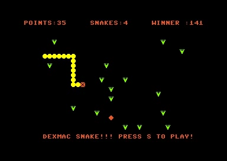

# Another Snake Game 
 
 

## About

Snake Game for the Commodore 64,128,16/plus4

Tailored for my own , but feel free to send patches, to open bugs, etc.

## Instructions

Use joystick in port two to control your snake, eat apples but don't run on yourself (very difficult if snaky is very long)


### Install support software

* Download [cc65](https://cc65.github.io/) to compile or sudo apt-get install -y cc65
* Download [VChar64](https://github.com/ricardoquesada/vchar64) to access to charater map (rebuild on ubuntu may be difficoult)
* Download [vice](https://jolyonbrown.com/post/vice-on-ubuntu/) following these instructions

### Command Line to build

```bash
git clone https://github.com/dexmac221/snake
cd snake

# to compile for commodore 64
make TARGET=c64

x64 snake.prg

# to compile for commodore 128 (native, 2mhz)
make TARGET=c128

x128 snake.prg

# to compile for commodore 16/Plus4
make TARGET=c16 xplus4

xplus4 snake.prg
```

## Supported platforms

* Commodore 64/128
* Commodore 16/Plus4
  
## Download binaries

* [snake commodore 64](snake64.zip)
* [snake commodore 16](snake16.zip)
* [snake commodore 128](snake128.zip)

## References

* [Commodore 16 Reference Book](https://archive.org/stream/Commodore_C16_Plus4_Reference_Book/Commodore_C16_Plus4_Reference_Book_djvu.txt)
* [Commodore Manuals](https://www.commodore.ca/commodore-manuals/)

## License

* [Apache v2](http://www.apache.org/licenses/LICENSE-2.0)

